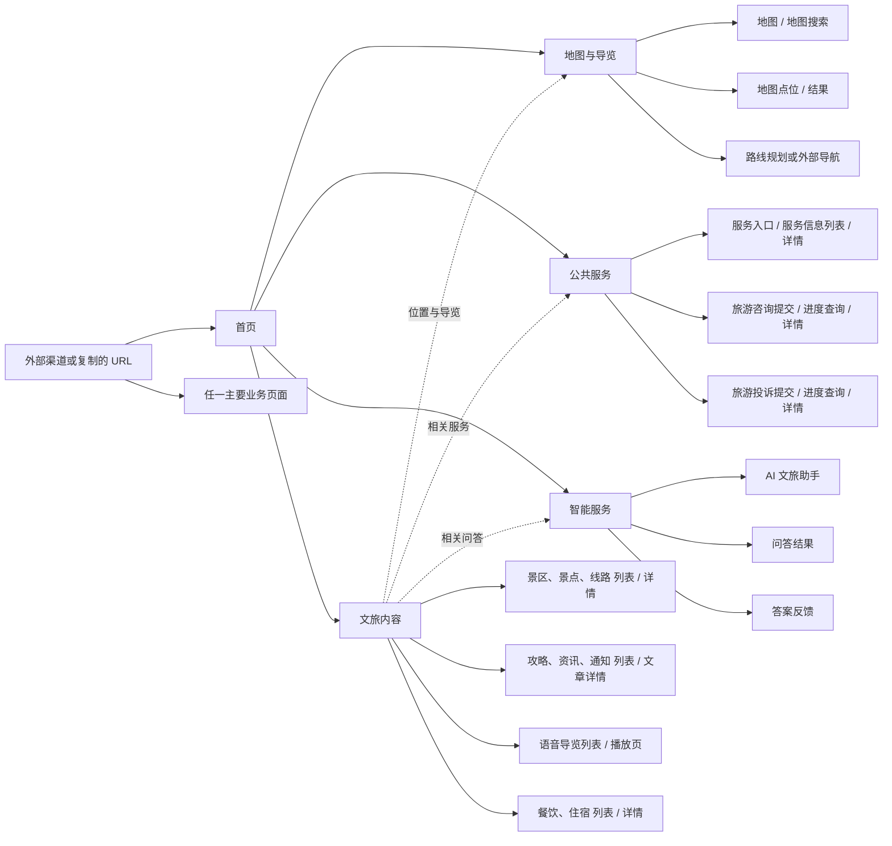

# 旅享西昌 H5 主任务

本文件是“旅享西昌”移动端 H5 的可续跑任务入口。开始 H5 工作前先阅读本文件、`../xichang-travel-api/docs/CODEX_GOAL.md`、根目录 `AGENTS.md`，以及实际修改仓库中的嵌套 `AGENTS.md`。本文只定义已确认的产品形态、范围和推进方式；未确认事项不得写成既定事实。

## 1. Objective

围绕 `../xichang-travel-api/docs/CODEX_GOAL.md` 已定义且适用于游客端的全部产品业务范围，交付一个完整可运行的“旅享西昌”移动端 H5，而不是静态页面或少量示例页面。H5 为游客提供文旅内容、地图与位置导览、公共服务和智能问答能力；已有业务能力即使后台或公开端链路尚未完成，也属于 H5 实施范围，只有现有产品范围中没有定义的功能才不得自行增加。

所有 H5 业务页面必须接入 `xichang-travel-api/` 提供的真实公开接口。当前 API Base URL 为 `http://travel.wifixc.test/api`；H5 开发代理 target / `VITE_SERVER_BASEURL` 的主机部分为 `http://travel.wifixc.test`，不得把 `/api` 再拼进 target（客户端路径本身已包含 `/api/...`），也不得使用 `localhost:8000` 作为最终联调基址。`travel.wifixc.test` 在本文仅指 API 主机，不是 H5 页面地址或其他运行时入口。后续实施需要同步完成公开 API、OpenAPI 契约、`xichang-travel-unibest/` 客户端和页面闭环，不以静态假数据或直接调用管理端接口作为最终交付。

首版交付必须支持主要页面独立访问、复制 URL 和直达。H5 可以有首页，但首页只是聚合入口，不是所有访问的必经入口；外部渠道可以直接落到首页、指定景区、地图、服务、攻略或其他主要业务页面。首版不建设分享工具、分享按钮、分享 API 或分享验收流程。

## 2. Product Shape

- 首版不设置常驻底部 Tab 导航。
- 每个主要页面拥有稳定、可配置的独立 URL，并能作为落地页直接打开。
- 页面通过正文关联、页面入口和顶部返回等方式流转，不要求从首页逐级进入。
- 直接访问页面时仍应具备完整标题、核心内容、必要操作、加载/空白/错误状态和合理返回路径；页面 URL 可由用户复制，并可作为外部直达地址。复制 URL 不等于建设分享能力。
- `xichang-travel-unibest/` 是“旅享西昌”H5 的专用承载与运行仓库。
- CRMEB 不是唯一入口，也不是 H5 建设的前置依赖；外部渠道只需配置目标 URL。

### Access and Identity

- 景区、景点、线路、文章、语音导览、餐饮、住宿、地图、服务信息和 AI 基础问答允许游客直接访问；所有公开内容的独立链接不得强制先登录。
- AI 基础问答允许游客使用并实施合理频率限制；登录后才提供可识别用户的历史记录等会员能力。
- 咨询与投诉允许游客提交。游客通过安全、不可猜测且不泄露身份信息的查询凭证查看进度和详情；已登录会员可在本人记录中查看。数据绑定、凭证存储、过期/撤销、限流和隐私规则由执行任务依据现有架构自主设计并测试。
- 首版不建设 CRMEB 与 H5 单点登录。CRMEB 或其他外部渠道只负责打开独立 H5 URL，打开后默认按游客身份处理；需要会员能力时使用 H5 现有会员登录。
- 普通 URL 参数不得直接传递可信会员身份。后续若建设无感登录，必须作为独立能力设计可信签名、时效、防重放和账号映射，不属于首版。

### Workspace Context

工作区根目录不是 Git 仓库，当前包含四个已核验的独立 Git 仓库：

- `xichang-travel-api/`：Laravel API，承载现有管理端能力，并将在稳定移交后按工程核查结论补齐 H5 所需公开端契约。
- `xichang-travel-console/`：Vue 管理后台，不承载 H5 页面。
- `xichang-travel-unibest/`：H5 承载仓库。实际清单确认为 pnpm 管理的 Vue 3、TypeScript、uni-app 和 Wot UI v2 应用，当前构建目标包含 H5 与微信小程序；本任务只以其 H5 目标推进。
- `xichang-travel-crmeb/`：独立 CRMEB/ThinkPHP 应用，不修改，也不是 H5 的入口或实现前置条件。

`xichang-travel-unibest/` 已验证可通过 `pnpm dev:h5` 在 `http://localhost:9000/` 启动开发服务，并通过 `pnpm build:h5` 生成 H5 构建；页面通过 `src/pages` 中的 `definePage` 元数据生成路由，并已有会员认证、Bearer 会话、OpenAPI 客户端和测试基础。景区与景点切片已新增真实列表、详情和正文关联页面。

首版常驻底部 Tabbar 已关闭；登录后的会员中心也按普通页面导航。任何模板自带页面、组件、跨端脚本或会员能力仍只算技术基础，不能据此扩大 H5 产品范围。

### Map Platform

- H5 地图供应商确定为腾讯地图，覆盖地图浏览、内容点位展示、点位与内容详情互跳、定位授权及外部路线导航；不自行建设导航引擎。
- 腾讯地图浏览器端/JS SDK key 通过 Unibest 环境变量 `VITE_QQ_MAP_KEY` 提供。当前只允许检查变量是否存在及应用是否具备读取路径，严禁在日志、文档、回复、截图、测试夹具或提交中输出、记录真实值，也不得为验证配置而发起地图调用。
- `VITE_` 变量会进入前端构建产物，`VITE_QQ_MAP_KEY` 必须按腾讯地图浏览器端 key 的安全模型使用，并配置允许的域名/Referer 白名单和必要配额限制，不能当作服务端私密凭据。
- 若后续服务端接口需要腾讯地图 Secret Key，必须使用独立的服务端环境变量；不得复用浏览器 key，也不得通过 API、OpenAPI、构建产物或日志将服务端 Secret 暴露给客户端。

## 3. Page Map

图中分组表达页面范围，不限定只能按该层级导航。详情、文章、地图点位和服务页面之间应允许基于内容关系互相进入。首版不包含全站搜索；各栏目可以复用其既有列表筛选或搜索能力，但不得据此新增跨模块搜索服务。

## 4. Scope / Exclusions

### 首版范围

- 聚合入口：首页。首页负责汇集现有业务入口，但不是其他页面的访问前置条件。
- 文旅内容：景区、景点、线路、文章、语音导览、餐饮、住宿的列表、详情及必要播放能力。
- 地图与导览：基于腾讯地图完成地图浏览、内容点位展示、点位与内容详情互跳、定位授权，以及路线规划或外部导航入口。
- 公共服务：服务信息浏览，旅游咨询提交、进度/查询和详情，旅游投诉提交、进度/查询和详情。
- 智能服务：AI 文旅助手、问答结果和答案反馈。
- 上述地图、咨询、投诉和 AI 能力均属于 H5 实施范围。执行任务必须自主核查并补齐其公开 API、身份/查询凭证、地图数据与坐标边界、真实模型运行和反馈链路；公开端能力尚未完成不代表产品范围外，也不是暂停推进并向用户索要工程事实的理由。
- 与现有 Laravel API、内容模型、媒体和管理端发布结果保持契约一致。公开端 API 的可用范围、缺口和推荐实现必须通过代码、配置、数据和 OpenAPI 证据自主得出。

### 明确排除

- 商品、票务、支付、订单、营销、售后和活动报名等交易能力。
- 全站搜索和跨模块搜索服务；各栏目既有列表筛选/搜索不受影响。后续如需全站搜索，作为独立产品能力另行确认和建设，不属于首版验收或阻塞项。
- 自行建设地图导航引擎；按腾讯地图和现有 H5 能力核查结论接入外部地图导航。
- 将 CRMEB 改造、CRMEB 入口配置或 CRMEB 发布作为 H5 的实现前置条件。
- 直接复用管理端 API、管理端登录或管理端权限模型。
- 首版 CRMEB/H5 单点登录，以及通过普通 URL 参数传递可信会员身份。
- 分享工具、分享按钮、分享 API、分享卡片和分享专项验收；首版只验证独立 URL 的复制、外部直达、刷新和返回。

### 公开端契约边界

管理端能力完成不等于公开 API 已完成。每项游客端能力都必须具备独立的公开路由和资源表达，仅返回已发布内容及最小必要字段，并明确游客/会员认证、查询凭证、限流、隐私和滥用防护边界；测试须覆盖发布过滤、字段最小化、认证/游客行为和关键安全场景。不得将管理端 RBAC API、管理字段或管理员身份直接暴露给 H5。

## 5. Engineering Investigation / Product Decisions

### 自主工程核查

以下事项由执行任务穷尽只读调查，自主形成证据化结论、推荐实施方案和缺口清单；不得作为问题反问用户，也不得因尚未核查而暂停实施计划：

1. 现有模型、字段、关系、发布状态、媒体能力及其游客端适用边界。
2. 景区、景点、餐饮、住宿等位置字段完整度、经纬度来源、实际坐标系，以及与腾讯地图常用 GCJ-02 的转换边界。
3. 当前管理端能力完成度、公开 API 缺口，以及公开路由、资源、认证、限流、发布过滤和字段最小化方案。
4. Unibest 的页面、`definePage` 路由、HTTP/OpenAPI、会员会话、环境变量读取、H5 构建和测试基础。
5. 咨询/投诉现有状态机、身份字段、可复用查询边界、隐私与安全需求。
6. AI 助手配置、知识库、真实模型调用、会话/问答和答案反馈链路的当前完成度。
7. 腾讯地图技术接入、定位授权/拒绝/失败、点位直达、外部导航唤起和 H5 降级能力；浏览器 key 白名单与配额只核查配置状态，不读取或回显密钥值。
8. 独立 URL 的复制、刷新、返回、失效链接和外部渠道直达在现有 uni-app H5 技术栈中的可行实现。

工程核查完成后直接更新能力矩阵和实施顺序并继续推进。发现缺口时采用符合现有架构与安全边界的推荐方案；只有该方案涉及下节真正不可推导的产品或外部业务选择时才请求确认。

### 仅需用户确认的产品或外部业务选择

只有在穷尽代码、数据、现有文档和配置后仍无法推导，且不同选择会实质改变产品行为时，才请求用户确认。请求前必须给出调查证据、推荐选项、替代选项和影响，不得只抛问题：

1. 正式部署域名、公开路径和其他无法从现有配置确认的外部资源；本地开发与可推导的构建路径由任务自行确定。

正式部署域名和公开路径属于上线前外部资源，不阻塞本地开发、公开 API 建设、H5 页面实现、本地测试或浏览器验收。

## 6. Delivery Strategy / Coordination

### 阶段 A：并行只读盘点

自主建立“能力 -> 现有模型/管理能力 -> 后台完成度 -> 公开 API -> H5 页面 -> 身份/外部依赖 -> 缺口”矩阵，并为每项给出证据、结论和推荐实施方案。只读检查 API、OpenAPI、管理端和 Unibest，不把运行中任务的未提交代码或生成契约当作稳定事实，也不把可核查事实转交用户解释。

### 阶段 B：稳定检查点移交与复核（已完成）

用户已确认主任务 `019ff394-c255-72f2-b351-3c84a2b9f8c5` 结束，本任务已接管 H5 所需 API、OpenAPI 和 Unibest 实施权。接管时 API 存在独立的“运营概览”未提交现场，现已由原任务形成稳定提交 `36cc652 feat: add operations overview api`；H5 切片未修改或混入该现场。

接管复核已完成：四个仓库独立 Git 根、API 迁移/OpenAPI、Unibest 构建与测试基础均已核对。后续每个切片继续复核动态状态并使用显式路径暂存。

### 阶段 C：端到端纵向切片

每个切片同步完成 Laravel 公开 API、独立公开资源与安全边界、OpenAPI 契约、Unibest 生成客户端/适配器、可直达的独立 URL 页面、聚焦与契约测试，以及 ego lite 移动端验收。候选顺序按依赖和接管时完成度调整，不作为跳过能力或提前冻结契约的承诺：

1. 内容基础：景区 -> 景点 -> 线路 -> 文章 -> 语音导览 -> 餐饮 -> 住宿。
2. 公共与地图：服务信息 -> 地图/位置导览 -> 咨询 -> 投诉。
3. 智能：AI 文旅助手/问答 -> 答案反馈。
4. 首页最后整合已经真实可用的模块，不用假数据承诺尚不可用入口。

### 阶段 D：完整集成与回归

完成全部既定游客端能力的跨模块内容关联、独立 URL 的复制/外部直达/刷新/返回行为、身份与隐私边界，以及 API、契约、H5 页面和真实移动端浏览器全量回归；不扩展分享能力。

## 7. Progress / Next Task

### 已完成：景点纵向切片（`ScenicSpot`）

- API：新增独立 `/api/public/scenic-spots` 列表和 `/api/public/scenic-spots/{code}` 详情；游客可访问，120 次/分钟/IP 限流，只展示 `published`，草稿、下线和未知 code 返回 404，Resource 仅输出游客所需字段。
- 契约：新增游客 API OpenAPI transformer，明确可空文本、坐标数值和封面最小对象；Unibest 客户端从实际 `docs/api.json` 生成。
- H5：关闭常驻底部 Tabbar；新增 `/pages/scenic-spots/index` 和 `/pages/scenic-spots/detail?code=...`，覆盖真实景点列表/详情、栏目搜索、加载、空白、错误、失效详情、重试、顶部返回、直接访问和刷新。后续已将首版误写的“景区”中文文案纠正为“景点”。
- 安全：Vite 开发日志改为只打印环境变量名，避免回显 `VITE_QQ_MAP_KEY` 等值；用户环境文件始终未暂存。
- 本地提交：API `71918f8 feat: add public scenic spot API`；Unibest `5f65e99 feat(h5): add scenic spot discovery`。均未 push、部署或发布。
- 验证：API 相关 38 tests / 2518 assertions 通过，Pint 通过；Unibest 15 files / 79 tests、type-check、ESLint、OpenAPI drift、Wot doctor/usage/lint、`build:h5` 通过。ego lite 在 390x844 开发态验证首页、2 条真实演示景点、详情点击、独立深链、刷新、顶部返回、404 失效页及无横向溢出，未发现运行错误事件。
- 环境说明：此前检查曾在 Node 24 下完成，与 `package.json` 声明的 Node 22 范围不一致；现有检查通过但持续出现 engine warning，最终全量验收须在项目声明的 Node 版本范围内再跑一次。Wot lint 仅对既有登录/会员页的 `wd-form-item`、`wd-cell-group` 报工具识别警告。

### 已完成：景区纵向切片（`Attraction`）

- API：新增 `/api/public/attractions` 与 `/api/public/attractions/{code}`，游客可访问并复用 `public-content` 限流；列表只展示 `published` 景区，草稿、下线和未知详情返回 404；详情只关联已发布 `ScenicSpot`。
- 契约与 H5：新增最小 `TourismAreaResource` 和真实生成客户端；新增 `/pages/attractions/index`、`/pages/attractions/detail?code=...`，首页分别提供景区、景点入口，景区详情可进入已发布景点独立 URL。
- 本地提交：API `a0726f1 feat: add public attraction API`；Unibest `54a4dc5 feat(h5): add attraction discovery`。均未 push、部署或发布，Unibest 用户环境文件未暂存。
- 验证：API 43 tests / 2568 assertions、Pint、完整 OpenAPI 生成通过；Unibest 17 files / 83 tests、type-check、ESLint、OpenAPI drift、Wot 检查和 `build:h5` 通过。ego lite 在 390x844 开发态验证首页双入口、2 条真实景区、点击/冷启动详情、刷新、景区到景点关联、404 冷启动及返回，无横向溢出或运行错误事件。

### 已完成：线路纵向切片

- API：新增 `/api/public/travel-routes` 与 `/api/public/travel-routes/{code}`，只公开已发布线路；详情保留节点顺序，并剔除关联到草稿/下线景区或景点的节点；最小节点契约不暴露关联 ID 和管理字段。
- 契约与 H5：线路节点通过联合类型引用既有景区/景点游客资源；新增 `/pages/travel-routes/index`、`/pages/travel-routes/detail?code=...`，支持栏目搜索、建议时长、有序节点及节点到景区/景点详情跳转，首页新增真实线路入口。
- 本地提交：API `ff1b31b feat: add public travel route API`；Unibest `71c4d92 feat(h5): add travel route discovery`。均未 push、部署或发布，用户环境文件未暂存。
- 验证：API 46 tests / 2595 assertions、Pint、完整 OpenAPI 生成通过；Unibest 19 files / 85 tests、type-check、ESLint、OpenAPI drift、Wot 检查和 `build:h5` 通过。ego lite 在 390x844 开发态验证真实已发布线路、独立详情、关联景点跳转及无横向溢出或运行错误；演示线路中关联草稿景点的节点未公开。

### 已完成：文章纵向切片

- API：新增 `/api/public/articles` 与 `/api/public/articles/{code}`，只公开已发布文章，支持文章栏目与栏目内关键词筛选；关联内容仅保留仍已发布的景区、景点、线路、餐饮或住宿目标。
- 安全与契约：新增服务端 HTML 白名单净化，移除脚本、事件属性、危险 URL 协议但保留常用正文结构；公开文章、分类和关联链接均为最小 schema，未暴露管理 ID、状态和排序字段。
- H5：新增 `/pages/articles/index`、`/pages/articles/detail?code=...`，提供全部/攻略/资讯/通知栏目筛选、栏目搜索、安全富文本正文和关联内容跳转；首页新增真实攻略资讯入口。
- 本地提交：API `4f81c39 feat: add public article API`；Unibest `cd82b2a feat(h5): add article discovery`。均未 push、部署或发布，用户环境文件未暂存。
- 验证：API 50 tests / 2629 assertions、Pint、完整 OpenAPI 生成通过；Unibest 21 files / 87 tests、type-check、ESLint、OpenAPI drift、Wot 检查和 `build:h5` 通过。ego lite 在 390x844 开发态验证仅已发布文章、栏目、正文、关联跳转和无横向溢出；DOM 确认无脚本、事件属性和危险协议。

### 已完成：语音导览纵向切片

- API：新增 `/api/public/audio-guides` 与 `/api/public/audio-guides/{code}`，仅公开已发布导览、ready 且未进入删除流程的音频，以及仍已发布的关联景区/景点/线路；不可播放详情统一 404。
- 契约与 H5：最小媒体契约只含公开 URL、MIME 和大小，播放时长由浏览器媒体元数据决定；新增 `/pages/audio-guides/index`、`/pages/audio-guides/detail?code=...`，覆盖列表、独立播放页、播放/暂停/结束/错误状态、讲解文稿和关联内容跳转，页面卸载销毁音频上下文。
- 本地提交：API `ce1afc3 feat: add public audio guide API`；Unibest `3320445 feat(h5): add audio guide playback`。均未 push、部署或发布，用户环境文件未暂存。
- 验证：API 42 tests / 2482 assertions、Pint、完整 OpenAPI 生成通过；Unibest 23 files / 89 tests、type-check、ESLint、OpenAPI drift、Wot 检查和 `build:h5` 通过。ego lite 在 390x844 开发态验证仅 1 条真实可播放导览、播放状态切换、关联景区跳转及无横向溢出或错误事件。

### 已完成：餐饮纵向切片

- API：新增 `/api/public/restaurants` 与 `/api/public/restaurants/{code}`，只公开已发布餐厅，支持分类与栏目关键词筛选；公开类别、坐标、封面/图集、电话、营业时间、人均价格、招牌菜，以及仍已发布的景区/景点关联，媒体仅包含 ready 且未进入删除流程的文件。
- 契约与 H5：生成最小 `DiningPlaceResource` 客户端；新增 `/pages/restaurants/index`、`/pages/restaurants/detail?code=...`，覆盖分类筛选、真实列表/详情、图集、电话、系统外部位置入口及景区/景点关联跳转，首页新增真实餐饮入口。地图浏览和聚合点位仍由独立地图切片完成。
- 本地提交：API `6dcc38a feat: add public restaurant API`；Unibest `d20ac5f feat(h5): add restaurant discovery`。均未 push、部署或发布，用户环境文件未暂存。
- 验证：API 41 tests / 2490 assertions、Pint、完整 OpenAPI 生成通过；Unibest 25 files / 93 tests、type-check、ESLint、OpenAPI drift、Wot 检查和 `build:h5` 通过。ego lite 在 390x844 开发态验证 2 条真实演示餐厅、分类、详情点击、详情 hash URL 冷启动、招牌菜、电话/位置入口及餐厅到已发布景区关联跳转，无横向溢出或网络/运行时错误事件。

### 已完成：住宿纵向切片

- API：新增 `/api/public/accommodations` 与 `/api/public/accommodations/{code}`，只公开已发布住宿，支持分类与栏目关键词筛选；公开现有模型中的类别、坐标、封面/图集、电话、入住/退房时间、参考价、设施和已发布景区/景点关联，不虚构房型、库存、预订或交易能力。列表不加载详情长文，公开图片在查询与 Resource 两层限制为 ready、未删除且为图片 MIME。
- 契约与 H5：新增最小 `LodgingPlaceResource` 和生成客户端；新增 `/pages/accommodations/index`、`/pages/accommodations/detail?code=...`，覆盖分类、真实列表/详情、设施、参考价、图集、电话、系统外部位置入口及景区/景点关联跳转，首页新增真实住宿入口。
- 本地提交：API `b1a611c feat: add public accommodation API`；Unibest `3862c75 feat(h5): add accommodation discovery`。均未 push、部署或发布，用户环境文件未暂存。
- 验证：API 529 tests / 9183 assertions、Pint、OpenAPI 漂移检查通过；Unibest 27 files / 97 tests、type-check、ESLint、OpenAPI drift、Wot 检查和 `build:h5` 通过。ego lite 在 390x844 开发态验证 2 条真实演示住宿、分类、参考价、设施、详情 hash URL 冷启动及住宿到已发布景区关联跳转，无横向溢出或网络/运行时错误事件。

### 已完成：地图与位置导览切片

- H5：新增 `/pages/map/index` 独立 URL，聚合景区、景点、餐饮和住宿四类真实公开 API 中坐标有效的内容点位；支持名称/地址搜索、类型筛选、地图 marker 与结果联动、内容详情互跳、GCJ-02 定位、腾讯地图外部路线导航，以及 SDK、定位和无点位失败降级。首页在真实点位链路可用后新增地图入口。
- 腾讯地图：通过既有 `VITE_QQ_MAP_KEY` 浏览器配置加载腾讯地图 JS SDK；未读取、记录或提交密钥值。开发态实际验证 SDK、地图画布和 marker 可用，外部路线 URL 不携带 key；生产环境仍需为正式域名单独配置浏览器 key、Referer 白名单和配额。
- 本地提交：Unibest `2ad2200 feat(h5): add map guidance`。该切片复用已完成公开内容 API，无 API/数据库改动，用户环境文件未暂存。
- 验证：Unibest 30 files / 103 tests、type-check、ESLint、OpenAPI drift、Wot 检查和 `build:h5` 通过。ego lite 在 390x844 开发态验证腾讯地图真实画布、8 个演示内容点位、餐饮筛选、详情跳转、独立深链刷新、首页入口及 SDK 失败降级，无横向溢出或运行错误事件。

### 已完成：服务信息纵向切片

- API：新增 `/api/public/service-information` 与 `/api/public/service-information/{code}`，游客可访问并复用 `public-content` 限流；只公开已发布服务，支持类型与栏目关键词筛选，草稿、下线和未知详情 404。列表省略长正文和附件，详情仅公开游客所需字段；封面限制为 ready、未删除的图片，附件仅公开 HTTPS 名称/链接并剔除内部顺序和不安全协议。
- 契约与 H5：新增最小 `VisitorServiceResource`、生成客户端，以及 `/pages/services/index`、`/pages/services/detail?code=...`；覆盖真实列表/详情、类型筛选、纯文本服务说明、电话、系统位置、HTTPS 资料、加载/空白/错误/失效状态和首页入口，不把管理端 API 或身份暴露给游客。
- 本地提交：API `5b64dc8 feat: add public service information API`；Unibest `a1ffcc1 feat(h5): add public service discovery`。均未 push、部署或发布，未修改迁移、Seeder、Console、CRMEB 或用户环境文件。
- 验证：API 536 tests / 9327 assertions、Pint、提交后 OpenAPI drift 通过；Unibest 33 files / 108 tests、type-check、ESLint、OpenAPI drift、Wot 检查和 `build:h5` 通过。ego lite 在 390x844 开发态验证仅 2 条已发布演示服务、列表/详情冷链、刷新、电话/位置/资料入口、纯文本正文和 404，无横向溢出或运行错误事件。

### 已完成：旅游咨询纵向切片

- API：新增游客咨询类别、提交和凭证查询接口，以及既有会员认证保护下的本人列表、提交和详情接口；管理端处置 API 未向 H5 暴露。游客凭证使用 256 位随机值，仅在创建响应返回一次，数据库只保存 SHA-256 摘要并支持 30 天到期和撤销；查询使用请求体，错误凭证、过期、撤销和未知工单统一 404，摘要、联系方式、管理员/受理人和内部 ID 不向游客公开。新增独立创建/查询限流，会员记录按 `member_id` 强制隔离。
- 契约与 H5：新增最小咨询类别和进度 Resource、OpenAPI 请求/响应及生成客户端；新增 `/pages/public-services/index`、`/pages/consultations/submit`、`receipt?ticket=...`、`query`、`detail?ticket=...`、`member-list` 和 `member-detail?ticket=...`。游客无需登录提交，凭证不进入 URL，只在成功回执和本机存储中使用；登录会员可查看本人记录。页面覆盖加载、空白、错误、失效链接、刷新、同路由参数切换和登录分流。
- 数据库与提交：执行单一安全前向迁移，只为 `consultations` 增加三个可空凭证摘要/到期/撤销字段及索引，未重置、删除或改写演示数据。API 本地提交 `7280fda feat: add public consultation API`、`c1620d4 fix: expose consultation credential expiry`；Unibest 本地提交 `3a7b2a1 feat(h5): add tourism consultation flow`。均未 push、部署或发布，用户环境文件未暂存。
- 验证：API 543 tests / 9461 assertions、Pint、提交后 OpenAPI drift 通过；Unibest 38 files / 114 tests、type-check、ESLint、OpenAPI drift、Wot 检查和 `build:h5` 通过。ego lite 在 390x844 开发态使用真实 API 完成游客提交、一次性回执、进度详情和刷新，确认凭证不在 URL、同路由失效工单进入安全状态、未登录“我的咨询”进入 H5 会员登录，且无横向溢出。验收新增一条明确标识的本地咨询记录并予以保留。

### 已完成：旅游投诉纵向切片

- API：新增游客投诉类别、临时证据上传、提交和凭证查询接口，以及会员认证保护下的本人列表、提交和详情接口；管理端处置 API 未向 H5 暴露。游客查询凭证为 256 位随机值，数据库只保存 SHA-256 摘要，支持 30 天到期和撤销；无效、过期、撤销和未知查询统一 404，游客响应隐藏联系方式、管理员和内部字段，会员记录按 `member_id` 隔离。
- 证据安全：只接收 JPEG、PNG、WebP，每张最大 5 MB、每单最多 6 张；上传声明仅保存令牌摘要并在一小时内可认领，创建投诉时事务锁定并消费，禁止跨投诉复用。新增两个安全前向迁移，未重置、删除或改写演示数据。
- 契约与 H5：新增最小投诉资源、上传 multipart/binary 契约和生成客户端；新增 `/pages/complaints/submit`、`receipt?ticket=...`、`query`、`detail?ticket=...`、`member-list`、`member-detail?ticket=...`。游客凭证不进入 URL，只在一次性回执和本机存储中使用；页面覆盖上传、加载、空白、错误、失效凭证、刷新和会员登录分流。
- 本地提交：API `4885e5a feat: add public complaint API`、`b24d2f4 docs: publish complaint API contract`、`2f239ed fix: describe complaint evidence upload`、`635c046 docs: update complaint upload contract`；Unibest `27c6403 feat(h5): add tourism complaint flow`。均未 push、部署或发布，用户环境文件和同期非 H5 Seeder 现场未暂存。
- 验证：投诉与契约聚焦 8 tests / 104 assertions、API 完整 551 tests / 9628 assertions通过；Unibest 41 files / 120 tests、type-check、ESLint、OpenAPI 漂移、Wot 检查和 `build:h5` 通过。ego lite 在 390x844 开发态完成真实游客提交、回执、详情、刷新和未知工单安全状态，并确认凭证不在 URL、无横向溢出；验收新增一条明确标识的本地投诉记录并予以保留。另修正会员入口登录回跳的双重编码，真实 URL 保持 `/pages/complaints/member-list` 且登录页正常显示。

### 已完成：AI 文旅助手与答案反馈纵向切片

- API：新增 `/api/public/ai-assistants` 列表/详情/问答、反馈分类和答案反馈公开路由；仅启用助手可见，公开 Resource 不暴露 provider、model、提示词、token 用量或内部知识编码。游客问答按 IP 限流，问答引用使用仅返回客户端的随机消息凭证，服务端保存摘要并设置过期；反馈由服务端可信快照校验且单次消费，未虚构游客历史或会话模型。
- 契约与 H5：从当前 `docs/api.json` 生成 AI 客户端和类型，新增 `/pages/ai-assistants/index`、`/pages/ai-assistants/chat?code=...` 独立页面，覆盖加载、空白、错误、直接刷新、游客提问、最小回答、反馈和无 URL 凭证。首页仅增加真实 AI 入口，不新增底部 Tab。
- 本地提交：API `8ee08e8 feat: add public AI assistant API`；Unibest `3d8470d feat(h5): add AI tourism assistant`。未 push、部署、发布或修改 CRMEB；Unibest `env/.env.development` 保持未暂存。
- 验证：API AI/OpenAPI 聚焦 42 tests / 2780 assertions，当前完整 API 604 tests / 9948 assertions，Pint 与 `composer docs:api:check` 通过；Unibest 44 files / 124 tests、type-check、ESLint、OpenAPI drift、Wot 检查和 `build:h5` 通过。ego lite 在 390x844 开发态使用真实启用助手完成列表、独立问答、真实回答、反馈、刷新和无横向溢出验收；验收后已恢复演示助手为 inactive。
- 联调基址：当前公开 API 使用 `http://travel.wifixc.test/api`；H5 开发代理 target 使用 `http://travel.wifixc.test`，客户端请求路径已包含 `/api/...`。该地址仅是 API 主机，不代表 H5 页面入口；不使用 `admin9-api-laravel.test` 或 `localhost:8000`，也不操作 MAMP。

### 已完成：AI 聊天式真实流式体验升级

- API：新增 `POST /api/public/ai-assistants/{aiAssistant}/chat/stream`，以 fetch 可读的 `text/event-stream` 输出 `start -> delta* -> complete|error`；真实火山方舟上游使用 `stream: true`，按完整 SSE 帧拼接多行 `data:`，解析 `delta.content`、`[DONE]`、错误块、`finish_reason` 和 `usage`，并通过分块缓冲处理 UTF-8/JSON 边界。未收到 `[DONE]` 的截断响应按失败处理。响应清理当前请求 PHP 输出缓冲，设置 `Cache-Control: no-cache, no-transform` 和 `X-Accel-Buffering: no`，逐事件 flush，并在上游读取及每个 delta 后检查客户端断开。
- 持久化与安全：完整答案和随机反馈凭证成功持久化后才发送 `complete`；停止、断连和失败不生成 `message_reference`，也不显示反馈入口。游客 IP 限流、已审核知识检索、反馈凭证 24 小时和一次性语义保持不变；公开流不泄露 provider、model、API 地址、token、系统提示词、知识正文或上游原始响应。
- OpenAPI/客户端：OpenAPI 记录流式请求、SSE 事件、安全说明和流开始前的 422/429/提供商错误边界，不把 HTTP/2 不保证存在的 `Transfer-Encoding: chunked` 写成应用契约；Unibest 生成类型与契约同步，流式读取使用独立 fetch 适配器，跨 `ReadableStream.read()` 保留 SSE 事件状态并统一处理读取中断。普通 JSON `/chat` 保留为兼容降级，停止后不再提交降级结果，不以延迟打印完整 JSON 模拟流式。
- H5：问答页改为消息流，欢迎语为首条 AI 消息，用户消息靠右、AI 消息靠左；同页可连续发送多个彼此独立的问题并保留显示。新增底部输入区、键盘避让、自动滚动、发送/停止、错误重试、加载/空白/错误状态，以及每条完成回答独立反馈。这里只是同页连续独立问答，不创建服务端多轮上下文，不新增 `conversation_id` 或历史会话，刷新不恢复服务端聊天历史。
- 提交与验证：初始实现提交为 API `9215a74 feat(api): add streaming public AI chat`、Unibest `6c7b95e feat(h5): add streaming AI chat experience`；缓冲、截断、跨 chunk 和取消边界加固提交为 API `61ca712 fix(api): harden public AI stream`、Unibest `f21b370 fix(h5): harden AI stream parsing`。提交后 API 612 tests / 10024 assertions、Pint、OpenAPI drift 通过；Unibest 44 files / 130 tests、type-check、ESLint、OpenAPI drift、Wot 检查和 `build:h5` 通过。测试覆盖 422/429、SSE 顺序、多 chunk、UTF-8、多行 data、上游错误/截断、首 delta 后取消不产凭证、字段脱敏和 JSON 降级停止。
- Review-Fix-Commit 收口：API `67f7240 fix(api): close AI stream review findings`、Unibest `e7c3d9a fix(h5): close AI chat review findings`。修复 H5 在 CRLF 跨读取边界拆分时的 SSE 状态丢失、反馈分类失败阻断聊天、JSON 降级停止不立即结束；修复 API 在插入后及发送 `complete` 前断开时遗留反馈引用，并将预流式 404 与流开始后的 SSE 错误边界准确写入 OpenAPI，移除流式端点不成立的 502/503/504 JSON 响应。复审后的 API 提交快照以隔离 SQLite 完成 614 tests / 10033 assertions、Pint 和 OpenAPI drift；Unibest 完成 44 files / 132 tests、type-check、ESLint、OpenAPI drift、Wot 检查和 `build:h5`。当前 API 工作树另有不属于 H5 的 `*_id`/业务 code 并发重构，未纳入上述提交或验证快照。
- 三层真流证据：`travel.wifixc.test` API 客户端测得 `start` 约 0.38 秒、首批 `delta` 约 4.49 秒、后续批次约 4.70/4.78 秒、`complete` 约 4.84 秒；ego lite 430x932 中浏览器 `ReadableStream.read()` 测得 `start` 约 0.94 秒、`delta` 约 3.08/3.29 秒、`complete` 约 3.34 秒，页面在 complete 前依次增长为 16、19、21、24、63、66 字；加固提交后 390x844 回归再次测得 `delta` 分批约 2.87/3.05/3.13 秒，页面在 complete 前由 14 增长到 60、64、68、70、77、78 字，约 3.18 秒才进入完成态。三层均证明不是结束后一次性渲染。
- ego lite：开发态 `http://localhost:9000/` 在 390x844 与 430x932 验证欢迎语、首字等待态、两次独立问题保留、完成后逐条反馈入口、停止后无反馈、429/断网/重试、输入区键盘适配、刷新不恢复历史、返回和无横向溢出；请求走相对 `/api` 代理到 `http://travel.wifixc.test`。Review-Fix-Commit 后 390x844 复核页面仍无横向溢出，上游错误时进入安全重试状态且不显示反馈；真实多批次 delta 时序复用未受本轮 UI/解析修复失效的既有证据。验收期间未操作 MAMP，未读取或输出任何地图/模型密钥。
- 边界：未新增分享、全站搜索、语音/图片/文件输入、工具调用、交易、多供应商、向量数据库、会员聊天历史、CRMEB SSO 或服务端会话。

### 已完成：首页整合与全量回归

已核对首页仅链接现有真实模块；批量访问首页、景区、景点、线路、文章、语音导览、餐饮、住宿、地图、公共服务和 AI 独立 URL，覆盖深链、刷新、返回、加载/空白/错误状态、跨模块关联和 390x844 无横向溢出。API 直接 PHPUnit 全套 604 tests / 9948 assertions、OpenAPI drift 通过；Unibest 全量 124 tests、type-check、lint、OpenAPI drift、Wot 检查和 `build:h5` 通过。真实联调统一使用 API Base URL `http://travel.wifixc.test/api`，H5 代理 target 使用 `http://travel.wifixc.test`，未把 API 地址当作 H5 页面地址，也未使用 `localhost:8000`。

### 最新接管复核（2026-08-13）

- 四个仓库状态复核完成：API 与 CRMEB 工作树干净；Console 仅保留用户既有 `.env.development`；Unibest 仅保留用户既有 `env/.env.development`。未读取或回显任何腾讯地图 key，未修改、暂存或提交受保护环境文件。
- 当前公开 API 基址 `http://travel.wifixc.test/api` 对 AI、景点、景区、服务信息等路由返回 200 JSON；H5 代理 target 为 `http://travel.wifixc.test`。`admin9-api-laravel.test` 仅为历史环境对照，不属于当前 H5 验收条件；本任务不操作 MAMP。
- `travel.wifixc.test` 已恢复并通过真实联调：公开 AI、景点、景区、服务信息接口均返回 200；Unibest 以一次性进程环境代理到该域名做了补充验收，未写入配置。ego lite 390x844 验证景点列表、地图真实腾讯地图画布和 8 个真实点位、AI 独立页、刷新/返回及无横向溢出；未读取或回显腾讯地图 key。
- 未读取或回显腾讯地图 key；Unibest 当前全量测试再次通过：44 test files / 124 tests。指定 API 基址上的移动端页面验收已完成。

### 2026-09-02 H5 生产发布

- 本次正式 H5 候选来自 clean `eda1cc08259b1175649ca286162d9d90fa096610`，并按完整 `origin/main..main` 历史审查，不仅覆盖 AI 推荐卡片，也覆盖既有游客端、流式 AI、地图/附近、停车和首页入口。发布前通过 52 files / 172 tests、类型检查、Lint、OpenAPI、Wot 检查及 H5/小程序构建；Wot 仅保留既有 unknown-component 警告。
- H5 在 `VITE_RELEASE_ID=xichang-20260902.1` 的正式候选环境下重建，产物为 151 files / 1,193,898 bytes；受控同步后与 API 发布副本逐字节一致，由 API 资产提交 `1c27151` 推送并经 Webhook 部署。生产响应发布头为 `X-Release-Id: xichang-20260902.1`。
- ego lite 在生产 `https://visit.wifixc.com` 的 390x844 视口验证首页、AI 助手列表和地图页，无横向溢出、破图、失败请求或控制台错误；地图真实加载 11 个点位。可视浏览器补充确认首页与 AI 助手卡片布局。本轮保持只读，不发起生产 AI 对话、不提交反馈。
- 微信小程序只完成构建，没有上传或发布；当前小程序产物仍含示例 API 主机，必须由后续独立任务修正生产配置并重新完成小程序门禁后，才能申请上传/发布授权。

### 2026-09-02 停车图片与正式运营图片

- H5 `602a0cf feat(h5): show parking facility media` 从最新公开契约生成停车封面/图集类型，停车列表显示 4:3 缩略图，详情复用 `PublicDetailCover` 与 `wd-swiper` 显示封面和可预览图集，附近内容和导航交互保持不变。
- 发布候选使用 `VITE_RELEASE_ID=xichang-20260902.2`，H5 产物为 151 files / 1,195,114 bytes，由 API 资产提交 `24c0625` 同步并部署；生产响应发布头为 `X-Release-Id: xichang-20260902.2`。
- 用户确认所有新图统一 `4:3`。餐饮 ID 13/14、住宿 ID 13/14/15、停车 ID 1/2 均已挂载 1 张封面和 1 张图集，14 张图像皆为 `1448×1086`、无文字与水印。
- 生产桌面与 390x844 逐页验证七个详情：每页均加载封面和图集，“暂无图片”全部消失，附近内容仍为 8 条，且无破图、失败请求、运行时错误或横向溢出；停车列表的两张缩略图也加载正常。
- 自动化通过 57 files / 201 tests、类型检查、完整 Lint、OpenAPI 漂移、Wot 检查以及 H5/微信生产构建；微信端仍只构建，未上传或发布。

### 当前下一任务

H5 网站当前发布栈、停车媒体与正式运营图片已部署并完成生产验收，没有遗留的网站发布动作。后续仅在用户提出新的已定义产品能力或缺陷时启动维护切片；微信小程序生产配置、开发者权限、模拟器/真机和上传发布仍是独立任务，不复用本次网站部署授权。

## 8. Completion Criteria

H5 首版完成时应同时满足：

- 页面地图中的首版页面均有可直接访问的稳定 URL，不依赖先进入首页或 CRMEB。
- `../xichang-travel-api/docs/CODEX_GOAL.md` 中全部既定且适用于游客端的能力均已在 H5 形成完整业务页面与流程；后台或公开链路曾经未完成不能成为删减范围的理由。
- 已发布内容才能按公开契约展示；草稿、下线内容和管理字段不会泄露到公开端。
- 详情关联、语音播放、地图与位置导览、咨询/投诉和 AI 问答及答案反馈按工程核查结论形成可用闭环；全站搜索明确不属于首版验收项或阻塞项。
- AI 问答使用真实 SSE 流式输出并提供聊天式消息布局、停止、重试、自动滚动、键盘适配和逐条反馈；同页连续问答仍是多个独立请求，不承诺服务端上下文或刷新恢复历史，取消/失败不生成反馈凭证。
- 公开内容和 AI 基础问答可由游客直接访问；AI 游客频率限制、登录会员历史能力、咨询/投诉游客查询凭证与会员本人记录均有明确实现与测试证据。
- 通过复制 URL 或外部渠道直达时默认按游客身份处理，CRMEB/H5 首版无单点登录，普通 URL 参数不能建立可信会员身份；独立 URL 的复制/直达、腾讯地图定位授权/拒绝/失败、坐标转换、点位直达、外部导航降级和隐私边界有明确实现与测试证据。
- 每项 H5 能力均接入真实公开 API；公开 API、OpenAPI 契约、H5 类型/客户端、错误行为和关键安全边界保持同步，不以静态假数据或管理端 RBAC API 代替。
- 关键页面完成移动端真实浏览器验收，覆盖直接深链、URL 复制/直达、刷新、返回、加载、空白和错误状态；验收不包含分享工具或分享流程。
- 文档记录真实进度、验证证据、未决事项和下一任务；未实现能力不写成已完成。当前公开 API 与 H5 移动端验收均使用已确认的 `travel.wifixc.test` 联调配置，不以 MAMP、`admin9-api-laravel.test` 或 `localhost:8000` 作为验收前置条件。

## 9. Execution Rules

1. 工作区根目录不是 Git 仓库，下含 API、Console、Unibest H5 和 CRMEB 四个独立仓库。修改前定位实际所属仓库，检查其 `AGENTS.md`、状态、历史和跟踪关系；保护其他进行中的修改。
2. `xichang-travel-unibest/` 是 H5 的既定承载仓库。先完成 `Next Task` 的自主只读核查与缺口分析；不改换技术栈、不另建 H5 仓库、不修改 CRMEB。
3. 后续按一个端到端 H5 纵向切片推进，同时覆盖独立 URL、页面、公开 API、契约、测试和浏览器验收，避免只做孤立页面或孤立接口。
4. 复用现有内容模型、媒体和发布能力，但不直接暴露管理端路由、管理字段、RBAC 或管理员身份。
5. 使用明确标识的西昌本地演示数据。不得对演示库执行 `migrate:fresh`、reset、rollback、truncate、清表或批量删除；测试必须使用隔离环境和专用数据。
6. 涉及网站页面时默认使用 ego lite 做真实移动端浏览器验证；`curl` 只用于 API/HTTP 辅助检查，不能替代页面验收。
7. 正式实施期间，每完成一个通过最小验证的端到端纵向切片，可以在各所属 Git 仓库创建范围清晰的本地提交。每个切片分别核对状态、差异、测试与提交文件，不从工作区根目录广泛暂存；不自动 push、部署、发布、打 tag 或修改 CRMEB。
8. 新增 H5 页面或能力必须能映射到 `../xichang-travel-api/docs/CODEX_GOAL.md` 已定义的业务范围，或现有模型、管理能力和可核验产品事实。无法映射的内容先作为提案，经用户确认后才能进入范围，不得直接设计或实现。
9. 主任务 `019ff394-c255-72f2-b351-3c84a2b9f8c5` 已稳定移交，原运营概览现场已由其提交。每个切片仍须重新核对状态、提交、迁移和契约；持续保护任何新出现的非 H5 改动、Console 的 `.env.development` 和 Unibest 的 `env/.env.development`，不得混入 H5 提交。
10. 地图配置检查不得读取或回显 `VITE_QQ_MAP_KEY` 的值。前端 key 只用于腾讯地图浏览器端能力并受域名/Referer 白名单和配额保护；任何服务端 Secret 必须独立保存，禁止进入客户端环境变量或前端产物。
11. 除破坏性操作、凭据获取、生产影响或穷尽调查后仍不可推导且会实质改变产品行为的决策外，不因信息不完整向用户提问。先完成只读调查，采用符合现有架构和范围的安全默认方案，记录证据、结论、推荐与影响后继续推进。
12. 用户已启动持续执行。不得在无真实阻塞时停留于盘点或方案；每完成一个纵向切片即更新本文件并继续下一切片，直至满足 Completion Criteria。
